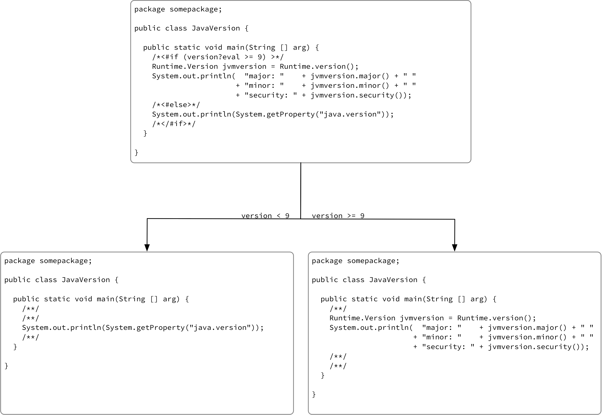
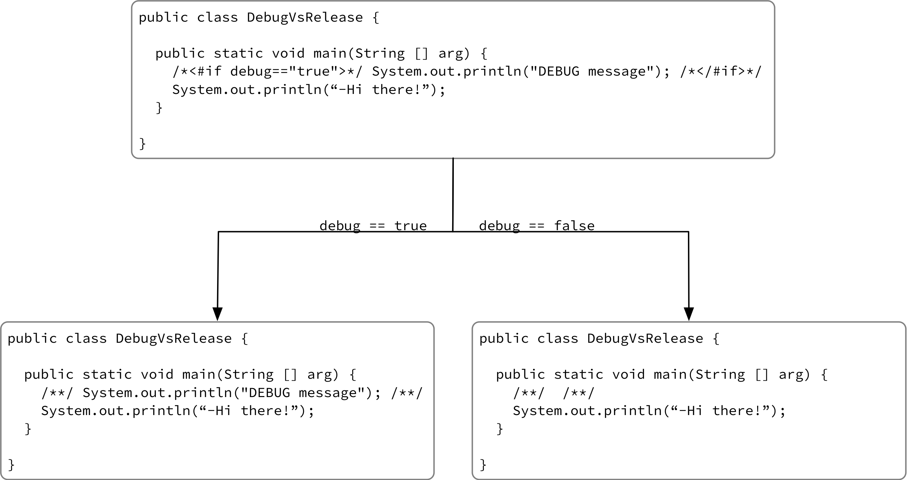

# Java Preprocessor

Based on [<#FreeMarker>](https://freemarker.apache.org) C like preprocessor for Java. It helps you generate different Java source code base - depending on <#FreeMarker> based control flow in the sources.

# Project structure

    .
	|-- LICENSE.md                             - MIT license file
    |-- README.md                              - this README.md file
    |-- bin
    |   `-- jpp.sh                             - wrapper to make running more convenient
    |-- build.xml                              - ant based build script for the project
	|-- images
	|   |-- debug_vs_release.png               - illustration of sample debug vs. release
	|   `-- java_version.png                   - illustration of different JVM's version APIs
    |-- resources
    |   `-- log4j2.xml                         - we want to format error and info differently
    |-- sample
    |   `-- src
    |       |-- DebugVsRelease.java            - debug vs. release passed as arg
    |       |-- DebugVsReleaseDefine.java      - debug vs. release defined in the code
    |       `-- somepackage
    |           `-- JavaVersion.java           - sample code for getting Java version
    `-- src
        `-- org
            `-- owsiak
                `-- preprocessor
                    |-- CLIParser.java         - handling cli args is done here
                    `-- JavaPreprocessor.java  - main class for Preprocessor

# Building

    > git clone https://github.com/mkowsiak/jpp.git
    > ant dist

# Running

    > java -jar dist/jpp.jar

    or

    > ant run

    or

    > export PATH=${PATH}:`pwd`/bin
    > jpp.sh

# Samples

## Preprocessing for different Java versions (e.g. getting JVM version)

    # if we plan to use the code with version < 9
    ./bin/jpp.sh -Dversion=6 -s sample/src -d sample/preprocessed -f somepackage/JavaVersion.java

    # if we plan to use the code with version >= 9
    ./bin/jpp.sh -Dversion=9 -s sample/src -d sample/preprocessed -f somepackage/JavaVersion.java

## Preprocessing for debug/release versions of code

    # if we plan to compile code with all debug stuff
    ./bin/jpp.sh -Ddebug=true -s sample/src -d sample/preprocessed -f DebugVsRelease.java
    
    # if we plan to compile code in "release" mode
    ./bin/jpp.sh -Ddebug=false -s sample/src -d sample/preprocessed -f DebugVsRelease.java

## It is possible to define variable inside source code as well

    ./bin/jpp.sh -s sample/src -d sample/preprocessed -f DebugVsReleaseDefine.java

# References

- [Adding jars into class path](https://alvinalexander.com/blog/post/java/ant-add-all-jars-lib-directory-to-classpath)
- [Adding class path jars to jar](https://stackoverflow.com/questions/7057229/how-to-include-classpath-jars-into-a-jar-in-ant)
- [Nice JAR tutorial - good for refreshing the knowlege](https://www.ibm.com/developerworks/library/j-5things6/index.html)
- [Place where all the JARs come from ;)](http://repo.maven.apache.org/maven2/)
- [Fighting the evil 'required' option in commons-cli](https://stackoverflow.com/questions/36720946/apache-cli-required-options-contradicts-with-help-option)
- [How to preprocess Java with C](https://lyubomyr-shaydariv.github.io/posts/2016-09-06-fun-with-java-and-c-preprocessor/)
